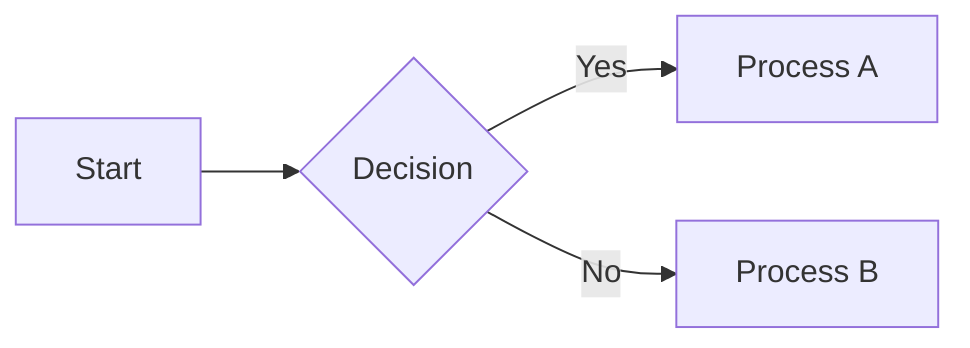
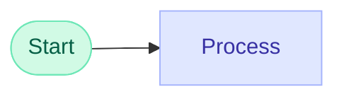

# Flowchart Hover Viewer

Mermaid.js flowchart viewer with hover detail panel, resizable panels, and zoom/pan support.

## Features

- **Mermaid Flowchart Rendering** - Write Mermaid code and instantly see the diagram
- **Hover Detail Panel** - Mouse over any node to see its detailed description
- **Resizable Panels** - Drag borders to adjust panel sizes
- **Zoom & Pan** - Mouse wheel to zoom, drag to pan
- **Pastel Gradient Nodes** - Beautiful color-coded node styles by type
- **Edge Labels** - Styled Yes/No labels on arrows
- **Single HTML File** - No backend required, works offline with internet for CDN

## Demo


## Usage

### Quick Start

1. Download `index.html`
2. Open in browser (double-click)
3. Done!

### For Restricted Environments (No File Download)

1. Open the [index.html on GitHub](https://github.com/Tenormusica2024/mermaid-hover-viewer/blob/master/index.html)
2. Click "Raw" button
3. Select all (Ctrl+A) and copy (Ctrl+C)
4. Open Notepad, paste (Ctrl+V)
5. Save as `mermaid-viewer.html` (Save as type: All Files, Encoding: UTF-8)
6. Open in browser

## How to Use

### Left Panel - Input

**Mermaid Code:**


**Node Details (JSON):**
```json
{
    "A": "This is the starting point of the flow",
    "B": "Check condition and branch accordingly",
    "C": "Execute when condition is true",
    "D": "Execute when condition is false"
}
```

### Right Panel - Output

- **Diagram** - Rendered flowchart with zoom/pan
- **Node Detail** - Shows description when hovering over nodes

### Controls

| Control | Action |
|---------|--------|
| **Render** button | Render the diagram |
| **Ctrl+Enter** | Render shortcut |
| **Mouse wheel** | Zoom in/out |
| **Drag diagram** | Pan |
| **+** / **-** buttons | Zoom in/out |
| **F** button | Fit to view |
| **1:1** button | Reset to 100% |
| **Drag borders** | Resize panels |

## Node Styles

Apply styles using `classDef` and `class` in Mermaid code:



### Available Styles

| Style | Color | Use For |
|-------|-------|---------|
| `startEnd` | Mint | Start/End nodes |
| `decision` | Peach | Decision/Branch nodes |
| `process` | Lavender | Process nodes (default) |
| `error` | Rose | Error handling |
| `warning` | Amber | Warning/Fallback |
| `success` | Lime | Success states |
| `info` | Sky | Information |
| `special` | Violet | Special processing |

## Tech Stack

- **HTML/CSS/JavaScript** - All inline, single file
- **[Mermaid.js](https://mermaid.js.org/)** - Diagram rendering (CDN)
- **[Panzoom](https://github.com/anvaka/panzoom)** - Zoom/pan functionality (CDN)

## Requirements

- Modern browser (Chrome, Firefox, Edge, Safari)
- Internet connection (for CDN libraries)

## License

MIT

## Author

Created with Claude Code
